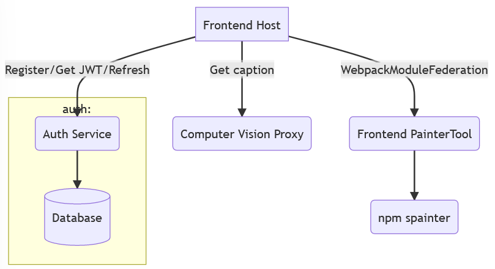
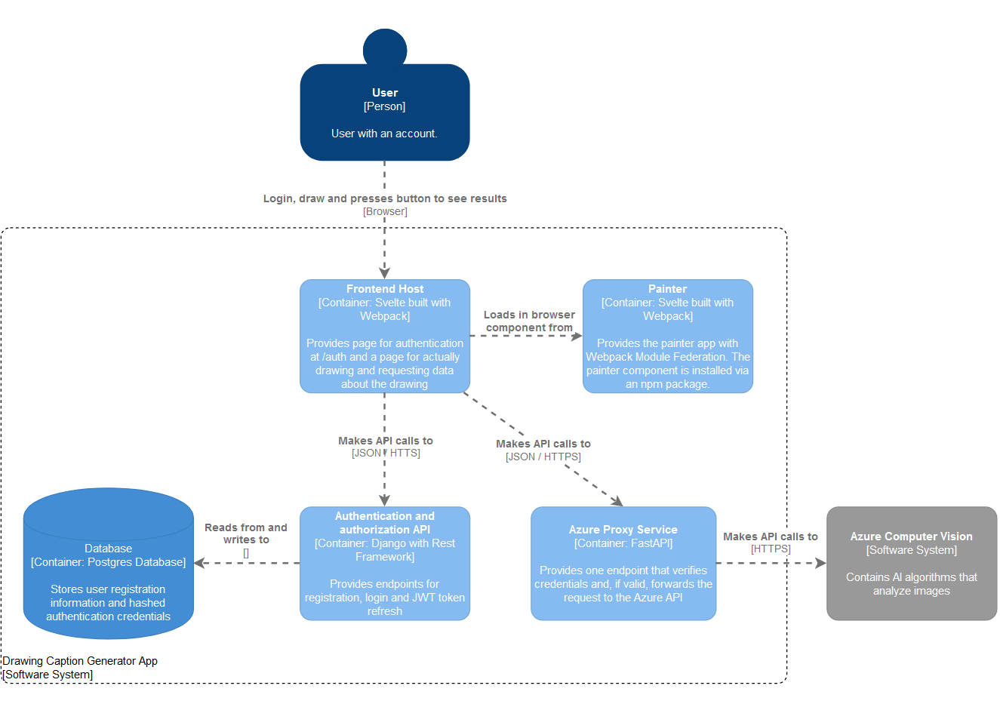

# Drawing Captioner App

App created as a final project for the [Service Oriented Architecture](http://www.cs.ubbcluj.ro/~ilazar/soa/) Subject. It is a software system based on different types of services and aims to implement some common use cases in web development and microservices.

## Idea

The app uses a paint component where a user can draw anything. The drawing is then sent to an AI service for [Computer Vision by Azure](https://azure.microsoft.com/en-us/services/cognitive-services/computer-vision/#overview) that analyzes content in images and returns captions and tags.

## Architecture

- The frontend is comprised of two components deployed separately. A host handles authentication and requests to the api, while a separate component serves a component installed via npm. They are bundled together using Webpack Module Federation. The statics are served by nginx which also acts as a reverse proxy to the other two services
- There is an authentication and authorization service that has a DB of users and provides jwt tokens
- The service that acts as a proxy to the Azure Computer Vision endpoint holds the url and key to the API. It validates the token on each request and forwards the valid ones.
- There are 5 containers used for the app, 2 for frontend, 2 for backend and 1 for the Postgres DB

</img>

</img>
